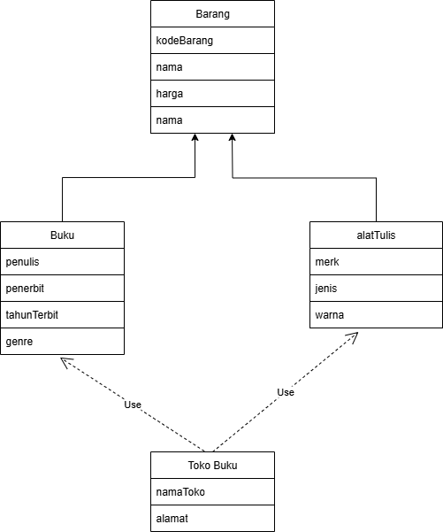
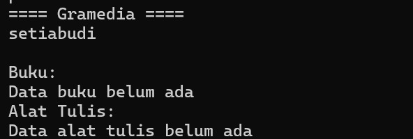
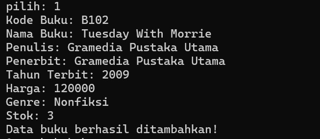
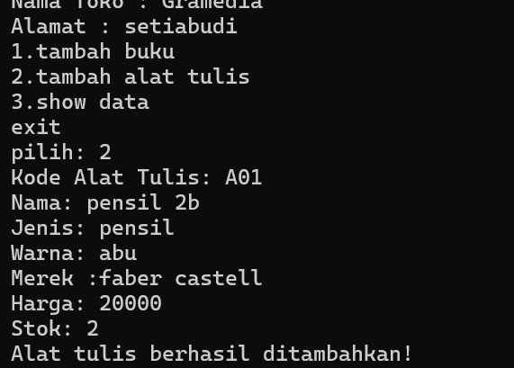
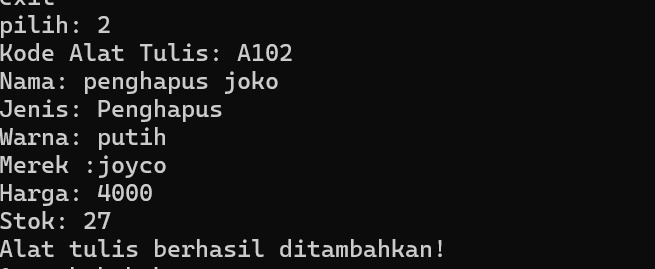
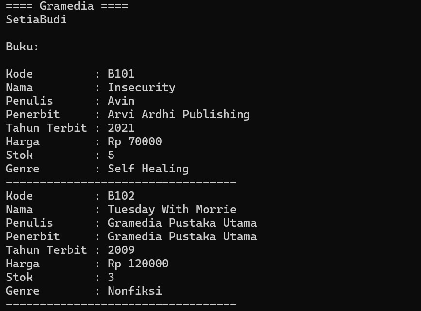

# TP3DPBO2425C2

## Janji
Saya **Putri Ramadhani** dengan NIM **2410975** mengerjakan TP3 dalam mata kuliah **Desain dan Pemrograman Berbasis Objek**, dengan ini saya menyatakan tidak melakukan kecurangan seperti yang telah dispesifikasikan. *Aamiin* 

## Desain Diagram Program

## Penjelasan Kelas
### 1. Class **Barang** (Parent)
Merupakan kelas parent yang menampung atribut umum dari semua barang.  
**Atribut:**
- kodeBarang → menampung kode unik dari tiap barang (Buku/Alat Tulis)  
- nama → nama barang  
- harga → harga dari sebuah barang(buku atau alat tulis)  
- stok → yaitu jumlah stok barang

**Method:**  
 class ini menggunakan getter dan setter untuk setiap atributnya

### 2. Class **Buku** (Child of Barang)
Merupakan turunan dari `Barang` (inheritance).  

Class ini memiliki 4 atribut yaitu:
- penulis → nama penulis buku  
- penerbit → nama penerbit buku  
- tahunTerbit → tahun buku diterbitkan  
- genre → genre buku  

**Method:**  
class ini menggunakan getter dan setter untuk setiap atributnya dan juga printBuku() yang mana mengembalikan data buku ke dalam bentuk list untuk dicetak ke dalam tabel yang akan ditampilkan

### 3. Class **AlatTulis** (Child of Barang)
 class ini sama seperti class Buku yang mana merupakan anak dari class Barang atau memiliki hubungan inheritance dengan class Barang
Class ini memiliki 3 atribut yaitu:
-merk, yaitu merk dari alat tul8us
-jenis, yaitu jenis aat tulis(misal pensil, pulpen,dsb)
-warna  

**Method:**  
Class ini menggunakan getter dan setter pada atributnya dan juga printAlat untuk mengembalikan data alat tulis dalam bentuk list untuk dicetak ke dalam tabel yang akan ditampilkan

### 4. Class **TokoBuku**
class ini memiliki hubungan composite dari class Buku dan class alatTulis yang mana class tokoBuku punya buku dan alat tulis
Clss ini memiliki atribut yaitu:
-namatoko, yaitu nama toko buku
-alamat, alamat toko
-daftarBuku, yaitu list yang menyipan objek dari class Buku
-daftarAlatTulis, yaitu list yang menyimpan objek dari class alatTulis

**Method:**  
1. addBuku(buku) → menambahkan objek buku ke daftar  
2. addAlatTulis(alat) → menambahkan objek alat tulis ke daftar  
3. printData() → menampilkan data toko, daftar buku, dan daftar alat tulis dalam bentuk tabel (menggunakan library **tabulate** pada Python)  

## Desain Program

### 1. Inheritance (Pewarisan)
class Barang, class Buku, dan class alatTulis memiliki hubungan hierarchial inheritance yang mana class Barang sebagai parent memili lebih dari 1 anak yaitu class Buku dan class alatTulis. Class Buku dan class alatTulis mewarisi atribut dan method dari class Barang

### 2. Composition    
class Buku dan alatTulis memiliki hubungan composeite dengan class tokoBuku yang mana class tokoBuku memiliki daftar objek dari Buku dan alatTulis da menyimpan banyak objek barang(dalam bentuk buku dan alatTulis)

## Alur Program
1. Ketika dijalankan program akan dimulai dengan meminta input nama toko dan alamat untuk membuat objek tokoBuku
2. Lalu user akan masuk ke pilihan dengan pilihan:
  1. Tambah Buku
  2. Tambah Alat Tulis
  3. Show Data
     exit
3. Jika user memgetik 1(tambah buku) maka user akan mengisi data bukku satu persatu yaitu(kode buku, nama buku, penulis,penerbit, tahun terbit, harga, genre, stok), lalu objek buki akan dibuat ke dalam daftarBuku milik class tokoBuku
4. Jika memilih 2(tambah alat tulis), maka akan mengisi data alat t ulis(kode alat tulis, nama, jenis, warna, harga, stok) dan objel akan dibuat ke dalam daftarAlatTulis
5. Jika memilih 3(show data) maka program akan mencetak an menampilkan informasi toko yaitu daftar buku dan daftar alar tulis ke dalam bentuk tabel. Jika data masih kosong maka program akan menampilkan pesan "belum ada data"
6. Jika memilih exit maka program akan keluar
7. Lalu jika menginput atau memilih selain pilihan terbut maka program akan menampilkan pesan "pilihan tidak valid,coba lagi"
  
Data ditampilkan menggunakan **Tabulate** (khusus Python).  

## Bukti:
C++:
Print Data sebelum ditambahkan

tambah data buku

.jpg)

tambah data alat tulis

Print Data setelah ditambahkan

Python:

Print sebelum data ditambahkan

Insert Data buku

insert data alat tulis

print data setelah ditambahkan

